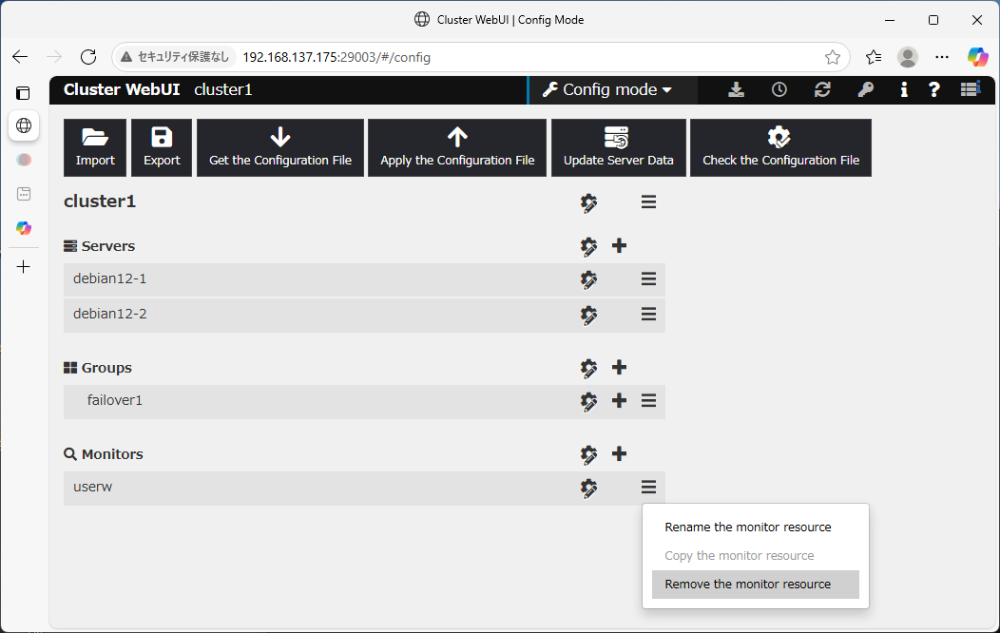

# EXPRESSCLUSTER 5 on Debian 12

Versions:

- EXPRESSCLUSTER X 5.3 for Linux
- Debian 12.11 (kernel 6.1.0-37-amd64)
- MariaDB 10.11.11 (an application to be protected)

Configuration:

- 2 nodes
- Data mirroring

----

Now in **2025.Jul.10**, Debian 12.11 has an issue that cannot load the watchdog.
Due to it, ECX `userw` cannot utilize `softdog` untill the *forthcoming update* of Debian.

<https://www.debian.org/News/2025/20250517>
> Known Issues
>
> Linux 6.1.137-1, included with Debian 12.11, is unable to load the watchdog and `w83977f_wdt` modules on the amd64 architecture. This is a regression.
>
> This issue will be fixed in a forthcoming update.
>
> Users who rely on the watchdog functionality should disable their watchdog or avoid upgrading to this kernel version until a fix is available.

A possible measure for now is omitting `userw` from the cluster configuration and rebert it once the problem on Debian will be fixed and the installation and configuration steps are as followings.
The disadvantage of omitting `userw` is that the OS will not automatically reset if a long delay occurs.
In a real system, operations would likely include manual operations such as "delay detection > **manual stop** > automatic failover".
As for an automation measure, the utilization of *forced stop* resource is also described.

----

## Installation and configuration steps

1. Servers preparation

    Prepare 2 servers. Each server has

    - 2 NICs
    - 2 DISKs

2. Debian installation and configuration

    Install Debian on `/dev/sda`.

    Configure disk `/dev/sdb1` to be replicated by DRBD.

    Configure network:
    - `eth0` to have `10.0.0.11/24` for public network example.
    - `eth1` to have `192.168.0.11/24` for private network example.

3. ECX installation and configuraiton

    On both VMs, prepare the package and license files of EXPRESSCLUSTER in the current directory and run the followings.

    ```bash
    sudo apt install ./expresscls-5.3.0-1.amd64.deb
    sudo clplcnsc -i *
    sudo reboot
    ```

    On *EXPRESSCLUSTER WebUI*, make and apply the configuration of the cluster as following (to prepare the installation of DRBD and MariaDB in later section).

    - failover1
        - fip1
    - fipw
    - userw

    **Remove *userw* monitor from the configuration.**

    

    Refere to the [Reference Guide](https://docs.nec.co.jp/software/clustering/expresscluster_x/x53/ecx_x53_linux_en/L53_RG_EN/L_RG_07.html#forced-stop-resource-details) about the *Forced Stop resource*.
    It helps to have a counter measure for processing delays in the absence of *userw*.

4. DRBD installation and configuration

    Follow the [article](https://github.com/EXPRESSCLUSTER/DRBD/blob/master/doc/2-node-cluster-ubuntu23.04.md) explaining how to enable DRBD on Ubuntu 23, and the same instructions apply to Debian 11.

5. MariaDB installation & configuration

    Install MariaDB on both VMs.

    ```bash
    sudo apt update
    sudo apt install -y mariadb-server mariadb-client
    ```

    Follow the [article](https://github.com/EXPRESSCLUSTER/MariaDB/blob/master/MariaDB%20with%20Linux.md) explaining how to enable MariaDB on RHEL 9.0, and the same instructions apply to Debian 11. In the article, the parameter *Libraly Path* would be `/usr/lib/x86_64-linux-gnu/libmariadb.so.3`.

6. Confirm the cluster configuration

    It would be like this:

    - failover1
        - fip1
        - exec-DRBD
        - exec-MariaDB
    - fipw
    - genw-DRBD
    - diskw-DRBD
    - mysqlw-MariaDB
